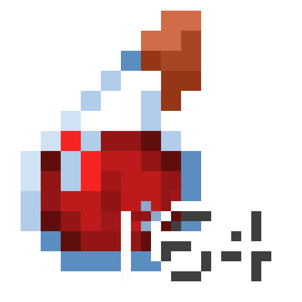

# Stackable Potions Plus



[简体中文](README.md) | **English**

Minecraft 1.20.1 · Forge mod · v1.4.4

> Mod ID: `stackablepotionsplus` | Based on [Stackable Potions](https://modrinth.com/mod/stackablepotions) by CursedFlames (MIT)

Makes vanilla potions truly **stackable and buffable**: potions stack into a single pile, drinking
consumes only one bottle and returns the glass bottle, the brewing stand brews whole batches,
and re-applying the same potion effect **extends its duration and raises its level**. Every value is
configurable.

---

## Overview

**Stackable Potions Plus** turns potions from one-shot consumables into a resource you can stockpile
and grow stronger.

In vanilla Minecraft a potion stack holds a single bottle, drinking the same potion again only refreshes
its duration instead of making it stronger, and the brewing stand brews one bottle at a time. This mod
reworks those, and adds the supporting behaviour potion stacking needs:

| | Vanilla | This mod |
|---|---|---|
| Potion stack size | 1 bottle | **64 bottles** (regular · splash · lingering) |
| Re-applying the same effect | Duration refreshed only | **Duration adds up + level increases** |
| Drinking from a stack | — | **Consumes 1 bottle, returns a glass bottle** |
| Brewing stand | 1 bottle per slot, one at a time | **64 per slot + whole-batch brewing**, Shift-click moves stacks |

On top of that, the mod is fully configurable: level cap, duration cap, infinite duration, whether
negative effects take part in stacking, and short-window stacking for instant effects.

Built for players and modpacks that want simpler potion logistics, or a "the longer the fight,
the stronger you get" playstyle.

---

## Features

| Feature | Default | Configurable |
|---|---|---|
| Potions stack | Up to 64 per stack (vanilla: 1) | Fixed (64) |
| Splash potion use cooldown (optional) | Off (vanilla has none) | ✅ `enableCooldown` |
| Drinking returns a glass bottle, consumes one bottle | On | Fixed |
| Brewing stand shift-click support | On | Fixed |
| **Brewing stand slot capacity** | 64 bottles per slot (vanilla hardcodes 1) | ✅ `potionSlotCapacity` |
| **Brewing stand batch brewing** | Brews the whole batch once ingredients ≥ the fullest slot | Fixed |
| Re-applying an effect adds duration | On | ✅ `durationCapSeconds` |
| Re-applying an effect raises its level | On, capped at level V | ✅ `maxAmplifier` |
| Infinite duration (effects never expire) | Off | ✅ `infiniteDuration` |
| Negative effects also stack | Off (vanilla behaviour kept) | ✅ `stackNegativeEffects` |
| Instant effect short-window stacking (heal/damage) | Off | ✅ `enableInstantStacking` + `instantStackWindowSeconds` |
| Numeric display for high effect levels | Levels above 10 shown as Arabic numerals | Fixed |

---

## Requirements

- Minecraft **1.20.1**
- Minecraft Forge **47.x** (declared as `[46,)`; use 47.1.0+ on 1.20.1)
- No other dependencies

Drop `StackablePotionsPlus-1.20.1-1.4.4.jar` into your `mods` folder.

> ⚠️ **Not compatible with the original mod.** This mod uses its own ID `stackablepotionsplus`.
> Do **not** install it alongside the original Stackable Potions — both modify `Items` registration
> and potion effect merging, and they will conflict.

---

## Configuration

A config file is generated on first launch:

```
config/stackablepotionsplus-common.toml
```

Comments in the generated file are written in Chinese. Changes require **restarting the game**.

### Options

#### 1. Effect stacking (`effect_stacking`)

| Key | Default | Range | Description |
|---|---|---|---|
| `maxAmplifier` | `4` | `0 ~ 127` | Highest level effects can stack to. Level I = 0, II = 1, so **level V = 4**. **Hard cap of 127 (= level 128)**: vanilla misbehaves at extreme amplifier values (jump boost above level 128 makes jumping fail entirely), so stacking never exceeds this |
| `durationCapSeconds` | `0` | `0 ~ 107374182` | Cap on the stacked total duration, in seconds. `0` = uncapped (bounded only by the game's integer limit) |
| `infiniteDuration` | `false` | `true / false` | When on, stacked effects **never expire**. Ignores `durationCapSeconds` |
| `stackNegativeEffects` | `false` | `true / false` | Whether negative effects (poison, slowness, weakness, wither…) also stack level and duration. Off by default: negatives keep vanilla behaviour (take the stronger/longer one, no level escalation) |
| `enableInstantStacking` | `false` | `true / false` | Whether **instant effects** (instant health / instant damage) get stronger when applied repeatedly in a short window. Off by default |
| `instantStackWindowSeconds` | `1.0` | `0.1 ~ 60.0` | Time window (seconds) for instant effect stacking. Applied repeatedly to the same target within the window, each application adds +1 to the level; outside the window the counter resets |

#### 2. Use cooldown (`cooldown`)

| Key | Default | Range | Description |
|---|---|---|---|
| `enableCooldown` | `false` | `true / false` | **Adds** a 1-second (20 tick) use cooldown to splash potions. Off by default, which matches vanilla |

> ⚠️ **Note**: vanilla 1.20.1 throwable potions (`ThrowablePotionItem`) have **no** use cooldown at all
> — verified against bytecode: across the whole `net.minecraft.world.item` package only
> `ChorusFruitItem`, `EnderpearlItem` and `InstrumentItem` call `ItemCooldowns.addCooldown`, and no
> potion item does. So this option **adds** a restriction rather than restoring a vanilla one, and it
> currently applies to splash potions only — **lingering potions are unaffected**.

### Default config

```toml
[effect_stacking]
	maxAmplifier = 4
	durationCapSeconds = 0
	infiniteDuration = false
	stackNegativeEffects = false
	enableInstantStacking = false
	instantStackWindowSeconds = 1.0

[cooldown]
	#为喷溅药水启用 1 秒（20 tick）使用冷却。默认关闭。
	#注意：原版 1.20.1 的投掷类药水本身没有使用冷却，本项是「新增」而非「恢复」原版限制。
	#当前仅对喷溅药水生效，滞留药水不受影响。
	enableCooldown = false
```

---

## How it works

### 1. Effect stacking

When a player or mob **already has** a potion effect and gains the same effect again:

- **Duration** is **added** to the remaining duration (vanilla keeps whichever is longer).
  - Example: Strength with 2:00 left, drink another (3:00) → 5:00.
  - Bounded by `durationCapSeconds`; `0` means uncapped.
- **Level** increases by 1 on top of the **higher** of the existing and incoming level.
  - Example: Strength I + Strength I → Strength II; Strength II + Strength I → Strength III.
  - Bounded by `maxAmplifier`, default `4` (level V). At the cap, further potions only extend duration.
- **Infinite**: with `infiniteDuration = true`, the stacked duration is set to infinite
  (`duration = -1`, equivalent to `/effect give ... infinite`). The HUD shows an infinity symbol
  and the effect never ticks down.

### 2. Negative effects stay vanilla by default

With `stackNegativeEffects = false`, poison, slowness, weakness and friends keep vanilla behaviour:
re-applying takes the stronger or longer version without escalating levels.

Set it to `true` to make negatives stack too — combined with 64-stacking, you can
pelt a mob group with poison and push it all the way to level V.

### 3. Glass bottle return

Drinking from a potion stack consumes one bottle and returns one glass bottle; the stack is never
swallowed whole.

### 4. Brewing stand

**Shift-click**: potion stacks can be shift-clicked straight into all three empty potion slots at once.

**Batch brewing**: each potion slot holds up to 64 bottles, and the whole batch brews in one go once
the ingredient count matches the **largest** of the three slots:

- How much ingredient you need is decided by the fullest potion slot. Put in 35 / 6 / 12 bottles and
  you need 35 ingredients before brewing starts.
- With too few ingredients the stand **won't light up**, so no blaze powder is wasted. It starts
  automatically once you top up.
- One brew takes the vanilla 400 ticks (20 s) and does **not** scale with the batch, so the progress
  bar renders correctly.
- Ingredients are consumed in one go (35 bottles → 35 ingredients).
- With a single bottle the mod behaves exactly like vanilla.

> **Two vanilla hard limits that both make stacked potions look like nothing is happening**
>
> 1. **The potion slot capacity is hardcoded to 1** — even with 64-stack potions, the slot accepted
>    only one bottle. Lift via `BrewingStandMenu$PotionSlot#getMaxStackSize()`; controlled by the
>    `brewing.potionSlotCapacity` config option (default 64; set to 1 for vanilla).
> 2. **Forge's brewing recipe system requires exactly one bottle per input slot** —
>    `BrewingRecipeRegistry.getOutput` starts with `if (input.getCount() != 1) return EMPTY`, and both
>    `canBrew` and `hasOutput` go through it. So `isBrewable` is permanently false for stacked potions
>    and the stand never starts. This mod takes over `isBrewable` / `doBrew` for batches: it queries
>    recipes with a single-bottle copy, then writes the full batch count back to the output.
>
> Without fixing both, the GUI just shows "full ingredients, no brewing".

### 5. Instant effect stacking (off by default)

Instant health / instant damage don't go through the "persistent effect stacking" path (they resolve
in a single tick and disappear), so duration/level stacking doesn't apply to them. With
`enableInstantStacking = true`:

- Within `instantStackWindowSeconds` (default 1 second), applying the same instant effect to
  **the same target** repeatedly adds +1 to the level each time (II → III → IV …);
- Outside the window, or targeting a different entity/effect, the counter restarts from the
  potion's own level;
- Results are still bounded by `maxAmplifier` and the hard cap of level 128.

Typical use: throw several instant damage potions at one mob, or chug instant health to heal up,
getting stronger each time. Drinking, splash and lingering paths all work.

### 6. High level display

The vanilla inventory effect panel only renders levels 1–10 as Roman numerals; **levels above 10 lose
their label entirely**. This mod fixes that: levels up to 10 keep the Roman numeral look, and
**anything above 10 is shown as an Arabic numeral** (11, 25, …), so raising `maxAmplifier` stays
readable.

---

## Version history

| Version | Notes |
|---|---|
| **1.4.4** | **Fixed two regressions caused by missing branches when taking over vanilla methods** (found by auditing every mixin against the vanilla implementation, the same technique used for 1.4.2/1.4.3):<br>① **Infinite-duration potions shortened existing buffs** — in `MobEffectInstance.update`, `this.duration + other.getDuration()` becomes `this.duration - 1` when `other.getDuration() == -1` (infinite), so drinking an infinite-duration Speed potion turned a 10-second Speed buff into 9.95 seconds. Vanilla routes through `isShorterDurationThan()`, which already checks `isInfiniteDuration()`; that layer was missing. Now "either side infinite ⇒ result infinite" is enforced.<br>② **Drinking potions no longer triggered sculk sensors / wardens** — `user.gameEvent(GameEvent.DRINK)` sits after the injection point in `PotionItem.finishUsingItem` and was swallowed by `cir.cancel()`. The event is now re-emitted inside the callback.<br>Also corrected the docs: vanilla 1.20.1 throwable potions have **no** use cooldown at all (verified against bytecode), so `enableCooldown` adds a restriction rather than restoring one, and it applies to splash potions only |
| **1.4.3** | **Fixed lost byproducts during batch brewing**: the 1.4.2 `doBrew` takeover missed vanilla's crafting-remainder handling — dragon's breath (registered with `craftRemainder(GLASS_BOTTLE)`) should return a glass bottle per brewed lingering potion, so a batch should return the whole batch. Now restored with vanilla semantics: when the ingredient runs out the byproduct takes over the ingredient slot, otherwise it is dropped into the world |
| **1.4.2** | **Fixed "full ingredients but no brewing"**: Forge's `BrewingRecipeRegistry.getOutput` starts with `if (input.getCount() != 1) return EMPTY`, and both `canBrew` and `hasOutput` go through it — so stacked potions are "unbrewable" as far as Forge is concerned: `isBrewable` is permanently false and `serverTick` never sets `brewTime` to 400, leaving the stand idle. This mod now takes over `isBrewable` / `doBrew` for batches: recipes are queried with a single-bottle copy and the full batch count is written back to the output. Also **removed the brew-time scaling** — the old design multiplied `brewTime` by the batch size (25600 ticks ≈ 21 min for 64 bottles), while the GUI progress bar divides by a hardcoded 400, producing a negative width that renders nothing at all |
| **1.4.1** | **Fixed "stacked potions can't be placed into the brewing stand"**: vanilla `BrewingStandMenu$PotionSlot#getMaxStackSize()` is hardcoded to return 1 — a separate limit from the item's stack size, so the slot still accepted only one bottle even with 64-stack potions. The slot capacity is now opened up via Mixin, with a new config option `brewing.potionSlotCapacity` (default 64; set to 1 for vanilla behaviour). Also rewrote the shift-click transfer check — the previous implementation only called `split` on the source stack without clearing it, leaving leftover items |
| **1.4.0** | Added **brewing stand batch brewing**: each of the three potion slots holds up to 64 bottles, and the whole batch brews in one go once the ingredient count matches the fullest slot. The stand won't light up with too few ingredients. Mixin priority is set to the maximum (`2147483647`) so this mod wins when another mod also touches the brewing stand or potion stacking |
| **1.3.1** | New mod icon (no longer reusing the original mod's art); the description, author and credits shown in the mod list are now Chinese and more concise |
| **1.3.0** | **Independent mod ID**: `stackablepotions` → `stackablepotionsplus`, package renamed to `lingyaocangxuan.stackablepotionsplus`, display name is now "Stackable Potions Plus". No longer clashes with the original mod's ID. MIT compliance completed: added `LICENSE.txt` (bundled into the jar under `META-INF/`), and `authors` / `credits` now credit both the original author and the porter. **Note: the config file is now `config/stackablepotionsplus-common.toml`; the old file is no longer read** |
| **1.2.0** | Instant effect short-window stacking (off by default, window configurable) |
| **1.1.2** | Hard cap of **level 128 (amplifier 127)** for all effect stacking; `maxAmplifier` range narrowed to 0~127 |
| **1.1.1** | Removed the stack-size config option (it could never work: item registration runs before the config loads, so stack size is now fixed at 64); added numeric level display |
| **1.1.0** | Full config support, Chinese comments; `maxAmplifier`, `durationCapSeconds`, `enableCooldown`, `infiniteDuration`, `stackNegativeEffects`; added zh_cn / en_us lang files |
| **1.0.2** | Effect stacking: duration adds up, level increases up to V |
| **1.0.1** | Potion stack size 16 → 64 (this entry originally also claimed "removed the 1s cooldown on splash/lingering potions"; vanilla 1.20.1 has no such cooldown, so that claim does not hold — see 1.4.4) |
| **1.0.0** | Original mod by CursedFlames: potions stack to 16 |

> 1.0.0 is the original 1.20.1 Forge release by CursedFlames. 1.0.1 and later are developed in this
> fork, released under the MIT license — see [LICENSE.txt](LICENSE.txt).

---

## FAQ

**Q: I changed the config but nothing happened in game.**
The config is read at game startup. Restart the game after editing (you don't need to re-enter the world).

**Q: How high can `maxAmplifier` go?**
Up to `127` (level 128). This is a **hard cap**: vanilla effects misbehave at extreme amplifier values
(the classic symptom being that jump boost above a certain level makes the player unable to jump at all),
so stacking never exceeds level 128. Levels 1–10 show as Roman numerals; above 10 this mod shows Arabic
numerals, and the numeric level still applies normally.

**Q: Can I change the stack size?**
No. Potions are fixed at 64 per stack (the vanilla default for ordinary items). A config option used to
exist, but it could never take effect because item registration happens before the config file is loaded,
so it was removed.

**Q: What might this conflict with?**
This mod mixins into vanilla item registration and potion effect merging. Other mods that modify
`Items` static registration, `MobEffectInstance.update`, or potion-related GUIs may conflict. Such
conflicts usually show up as a mixin apply failure at startup (`Mixin apply failed` in the log) —
provide the log if you hit one.

**Q: Do I need it on both client and server?**
The mod changes item properties at registration time and effect merging, which must stay in sync.
**For multiplayer, install it on both the server and the client**, otherwise stack sizes / data may
desync. Singleplayer only needs it locally.

**Q: Why is `durationCapSeconds` 0 instead of a huge number?**
`0` means "no cap"; the stacked duration is then bounded only by the game's int limit (~2.1 billion
ticks, unreachable in practice). Enter a specific number of seconds if you want "stacking stops at
N seconds".

---

## License & Credits

This is a Minecraft 1.20.1 / Forge port and enhancement of **Stackable Potions** by **CursedFlames**.

- Original mod: <https://modrinth.com/mod/stackablepotions>
- Original license: **MIT License**, `Copyright 2020 CursedFlames`

Under the terms of the MIT license, this port is likewise released under the **MIT License**. The full
license text is in [`LICENSE.txt`](LICENSE.txt) and is bundled into the jar as `META-INF/LICENSE.txt`.

```
Copyright 2020 CursedFlames
Copyright 2026 Lingyao-cangxuan
```

New / changed in this port:

| Content | Attribution |
|---|---|
| Duration stacking, level escalation, negative-effect separation, infinite duration | New in this port |
| Instant effect short-window stacking | New in this port |
| Numeric display for levels above 10 | New in this port |
| Level 128 hard cap (works around a vanilla bug) | New in this port |
| Full config file and zh_cn / en_us localisation | New in this port |
| Potion stacking, glass bottle return, brewing stand shift-click | Ported from the original mod (MIT) |

The icon `icon.png` is reused from the original mod (MIT, copyright CursedFlames).
The original repository has been archived and moved to <https://github.com/CursedFlames/MCTweaks>,
but its MIT grant is irrevocable and remains valid.
